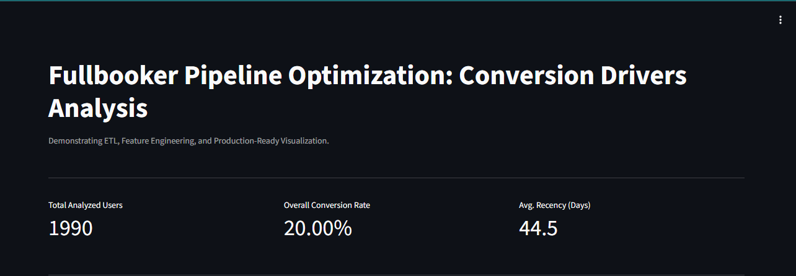
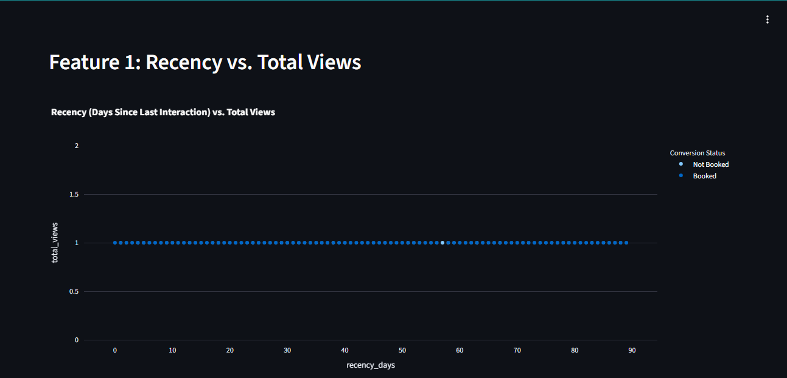

# Data Quality & Analytics Microservice

An end-to-end data engineering pipeline that simulates user interactions, performs automated data validation (CUV framework), and visualizes conversion drivers.

## Live Demo (Project Interface)

Below is the visual evidence of the microservice in action. These screenshots represent the three main components of the analytical output:

### 1. Executive Summary & KPIs
This section displays the high-level metrics after the ETL pipeline has cleaned the raw data (identifying 1,990 valid users).


### 2. Behavioral Analysis (Scatter Plot)
This chart visualizes user engagement (Total Views) against Recency to identify clusters of high-intent customers.


### 3. Price Sensitivity (Box Plot)
This distribution analysis compares the average price viewed by 'Booked' vs 'Not Booked' users to detect price resistance.


---

## The Pipeline
1. **Ingestion:** Simulates 2,000+ user interactions using `Faker`.
2. **Data Quality (DE):** Automated checks for:
   - **Completeness:** Median imputation for missing pricing.
   - **Validity:** Clipping duration outliers.
   - **Consistency:** Filtering invalid experience categories.
3. **Feature Engineering (DS):** Generating Recency, Frequency, and Monetary (RFM) features.
4. **Visualization:** A Streamlit dashboard utilizing Plotly.

##  How to Run
```bash
pip install -r requirements.txt
python data_pipeline.py
streamlit run app.py
```
